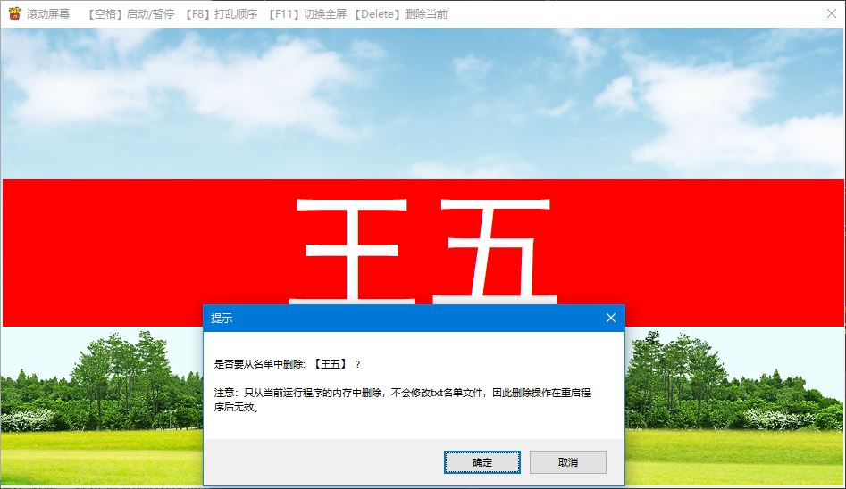

# NameListRoll--抽奖程序

**该项目简单的实现了抽奖功能，可以应用于大会抽奖，多人抽签等场景。**

## 开发环境
VS2015 + MFC

## 软件界面
- 待机界面

***
- 运行界面

## 主要功能
- 按【空格】启动或暂停屏幕滚动。
- 在停止滚动状态下，按【F8】打乱当前的抽取项顺序。
- 按【F11】在正常窗口大小和全屏间切换。
- 在停止滚动状态下，按【Delete】删除屏幕显示抽取项。可以应用于抽奖时，已中奖人员的剔除场景。

Tips: 
- 【F8】和【Delete】仅在停止滚动状态下有效。
- 【F8】打乱滚动项顺序后，在下一次按【空格】启动屏幕滚动时，滚动顺序已经被打乱。
- 【Delete】删除屏幕显示抽取项后，在下一次按【空格】启动屏幕滚动前，屏幕仍将显示该抽取项，非程序bug。

## LICENSE
MIT